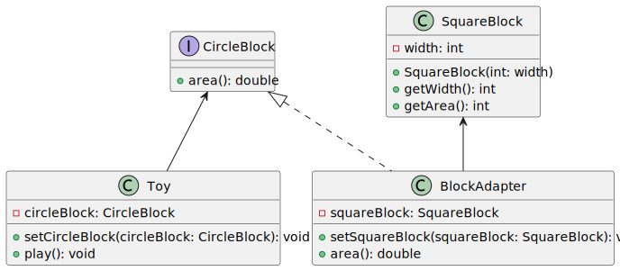
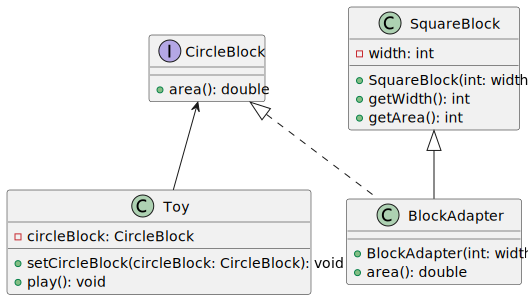

# Adapter (어댑터)

## 목적

클래스를 클라이언트가 원하는 타입으로 변환하여 호환되지 않는 객체를 활용할 수 있습니다.

## 예시

원형 블럭을 필요로 하는 장난감이 있다고 가정해봅시다. 우리가 갖고 있는 블럭은 네모 블럭밖에 없는 상황에서 이 문제를 어떻게 해결해야 할까요? 직접 원형 블럭을 만들자니 네모 블럭이랑 형태만 다르지 쓰임새는 비슷하고, 억지로 끼우자니 구멍에 안 맞는 상황. 이럴 때 어댑터를 사용할 수 있습니다.

클래스 `Toy`가 동작하기 위해서 `CircleBlock`를 주입받아야 합니다.

```java
public interface CircleBlock {

    double area();

}

@Setter
public class Toy {

    private CircleBlock circleBlock;

    public void play() {
        System.out.println("Toy is joined with circle block whose area is " + circleBlock.area());
    }

}
```

하지만 우리가 갖고 있는 `SquareBlock`은 `CircleBlock`과 호환되지 않습니다.

```java
@Getter
@RequiredArgsConstructor
public class SquareBlock {

    private final int width;

    public int getArea() {
        return this.width * 2;
    }

}
```

이럴 때 어댑터를 사용할 수 있습니다.


> `SquareBlock`이 `CircleBlock`을 구현하도록 하면 되지 않나요?

호환되지 않는 클래스를 변경하는 게 간단하다면 권장합니다. 다만 아래의 문제가 있습니다.

* `SquareBlock`이 유사한 성격의 API(`getArea()`, `area()`)를 노출하여 애매모호함을 야기합니다.&#x20;
* `SquareBlock`은 `CircleBlock`과 비즈니스적 연관성이 없는데도, 구현을 책임져야 합니다.
* 호환되지 않는 클래스가 늘어날수록, 코드도 그만큼 고쳐야 합니다.


## 구현

### Object Adapter (객체 어댑터)

[Target 타입](#user-content-fn-1)[^1]을 구현하고 Adaptee를 <mark style="background-color:purple;">합성</mark>하는 형태입니다.



```java
@Setter
public class BlockAdapter implements CircleBlock {

    private SquareBlock squareBlock;

    @Override
    public double area() {
        int width = squareBlock.getArea() / 2;
        return width * 3.14;
    }

}
```

인터페이스 `CircleBlock`를 구현한 어댑터 클래스를 만듭니다. 이 어댑터는 `SquareBlock`를 받아서 `CircleBlock`구현에 활용하고 있습니다. 마치 네모 블럭을 원형 블럭으로 변환하는 것처럼요.

이제 `SquareBlock`으로 `Toy`를 마음껏 사용할 수 있습니다.

```java
BlockAdapter adapter = new BlockAdapter();
adapter.setSquareBlock(new SquareBlock(4));

Toy toy = new Toy();
toy.setCircleBlock(adapter);
toy.play(); // Toy is joined with circle block whose area is 12.56
```

### Class Adapter (클래스 어댑터)

Adaptee를 <mark style="background-color:purple;">상속</mark>하여 해결할 수도 있습니다.



```java
public class BlockAdapter extends SquareBlock implements CircleBlock {

    public BlockAdapter(int width) {
        super(width);
    }

    @Override
    public double area() {
        return super.getWidth() * 3.14;
    }

}
```

이제 Adapter와 Adaptee를 따로 생성할 필요가 없습니다.

```java
Toy toy = new Toy();
toy.setCircleBlock(new BlockAdapter(6));
toy.play(); // Toy is joined with circle block whose area is 18.84
```

안타깝게도 이 방법은 한계점이 있습니다. `SquareBlock`의 서브 클래스 `WoodenSquareBlock`이 있다고 가정해봅시다. `BlockAdapter`는 이미 `SquareBlock`를 상속했기 때문에 `WoodenSquareBlock`에서 추가된 기능을 사용할 수 없습니다.

### 주의사항

상속은 제약사항이 있습니다. 인터페이스의 Method Signature가 동일하고 반환 타입이 서로 호환되지 않는 관계라면 컴파일 에러가 발생하는 점입니다.

만약 `CircleBlock`이 아래와 같았다고 가정해봅시다.

```java
public interface CircleBlock {

    double getArea();

}
```

`BlockAdapter`가 인터페이스를 구현할 때 문제가 발생합니다.

```java
public class BlockAdapter extends SquareBlock implements CircleBlock {

    public BlockAdapter(int width) {
        super(width);
    }

    @Override
    public double getArea() { // Compile Error
        return super.getWidth() * 3.14;
    }

}
```

메서드의 반환 타입이 서로 호환되지 않는 관계이기에 `int getArea()`, `double getArea()` 메서드 2개를 구현해야 합니다. 하지만 Java 언어의 제약으로 Signature가 같은 메서드는 하나의 클래스에서 둘 이상 만들 수 없습니다.

이런 경우에는 아래의 방법으로 해결할 수 있겠죠.

1. `SquareBlock`의 Method Signature를 변경한다. (`CircleBlock`을 수정할 수 없을 경우)
2. 객체 어댑터 방식으로 해결한다.

1번은 그닥 좋은 방법이 아닙니다. `SquareBlock`를 사용하는 기존 클래스가 많을수록 변경의 영향이 커집니다. 게다가 `Toy`가 아래와 같이 변경된다면 어댑터 패턴을 사용한 게 오히려 독이 될 수도 있습니다.

```java
public interface TriangleBlock {

    long getArea();

}

public class Toy {

    private CircleBlock circleBlock;

    private TriangleBlock triangleBlock;

    public void setCircleBlock(CircleBlock circleBlock) {
        this.circleBlock = circleBlock;
        this.triangleBlock = null;
    }

    public void setTriangleBlock(TriangleBlock triangleBlock) {
        this.triangleBlock = triangleBlock;
        this.circleBlock = null;
    }

    public void play() {
        Number area = this.circleBlock == null ? this.triangleBlock.getArea() : this.circleBlock.getArea();
        System.out.println("Toy is joined with circle block whose area is " + area);
    }

}
```

클라이언트가 원하는 새로운 타입 `TriangleBlock`이 추가됐고, Method Signature가 동일한 상황입니다.

이 경우 어댑터 클래스가 `CircleBlock`와 `TriangleBlock`을 다중상속하는 순간 똑같이 컴파일 에러가 발생합니다. 심지어 `SquareBlock`은 구현하지도 않았는데도 말이죠. 게다가 Adaptee가 새로 추가되면 어떻게 될까요?

```java
interface CircleBlock {

    double area();

}

interface SquareBlock {

    int getSquareArea();

}

interface RectangleBlock {

    int getRectangleArea();

}

public class BlockAdapter implements SquareBlock, RectangleBlock, CircleBlock {

    private final int width;

    private final int length;

    private BlockAdapter(int width, int length) {
        this.width = width;
        this.length = length;
    }

    public static BlockAdapter asSquare(int width) {
        return new BlockAdapter(width, width);
    }

    public static BlockAdapter asRectangle(int width, int length) {
        return new BlockAdapter(width, length);
    }

    @Override
    public double area() {
        int diameter = Math.min(this.width, this.length);
        return diameter * 3.14;
    }

    @Override
    public int getSquareArea() {
        return this.width * 2;
    }

    @Override
    public int getRectangleArea() {
        return this.width * this.length;
    }

}
```

인터페이스 `RectangleBlock`가 추가되어, 기존의 생성자 `BlockAdapter(int)`만으로는 변경사항을 수용할 수 없게 되었습니다. 이 어댑터는 사용 책임뿐 아니라 생성 책임을 인터페이스 개수만큼 갖고 있어 무거운 클래스가 되었습니다. 이 상황에 인터페이스 `DiamondBlock`가 추가된다고 생각하면... 끔찍하네요.

이걸 객체 어댑터로 구현해보겠습니다.

```java
interface Block {

    int getWidth();

    int getLength();

}

interface SquareBlock extends Block {
}

interface RectangleBlock extends Block {
}

@Setter
public class BlockAdapter implements CircleBlock {

    private Block block;

    @Override
    public double area() {
        int diameter = Math.min(this.block.getWidth(), this.block.getLength());
        return diameter * 3.14;
    }

}
```

상위 Adaptee 인터페이스 `Block`으로 여러 인터페이스를 수용할 수 있도록 변경했습니다. 생성 책임을 외부에 전가하고 사용 책임만 담당하여 **SRP**를 만족했습니다. 그렇다고 상속이 무조건 안 좋은 방법이라는 건 아닙니다. Adaptee가 잘 변경되지 않는 부분이고 복잡한 로직을 갖고 있지 않다면 간단한 해결 방법이 될 수 있습니다.

다만 실무에서는 대부분 Adaptee가 복잡한 로직을 갖고 있습니다. 합성을 통해 비즈니스 로직은 Adaptee에게 구현 책임을 지우고 Adapter는 Adaptee와 클라이언트를 연결해주는 책임에 집중하는 게 좋은 방법이라고 생각합니다.

### 실제 적용 사례

Spring Validation을 보면 어댑터 패턴으로 설계되어 있습니다.

```java
public class SpringValidatorAdapter implements SmartValidator, jakarta.validation.Validator {

    @Nullable
    private jakarta.validation.Validator targetValidator;

    public SpringValidatorAdapter(jakarta.validation.Validator targetValidator) {
        Assert.notNull(targetValidator, "Target Validator must not be null");
        this.targetValidator = targetValidator;
    }

    void setTargetValidator(jakarta.validation.Validator targetValidator) {
        this.targetValidator = targetValidator;
    }
    
    /* ... */

}
```

`SmartValidator`는 `org.springframework.validation.Validator`의 서브 인터페이스입니다.\
흥미롭게도 합성과 상속을 모두 활용하여 JSR-303와 Spring Validation 간 비호환성을 해결했습니다.

<mark style="background-color:purple;">합성은 단방향 호환</mark>만 지원하지만, `SpringValidatorAdapter`는 <mark style="background-color:purple;">양방향 호환을 위해 상속</mark>을 쓸 수밖에 없는 상황입니다. 합성만 사용하려고 한다면 어댑터를 2개 만들어야 합니다.

합성을 함께 사용한 이유는 `jakarta.validation.Validator`의 구현체가 `org.hibernate.validator.internal.engine.ValidatorImpl`인데, Spring이 구현체에 직접 의존할 필요도, 직접 구현할 필요도 없기 때문입니다.

계속해서 `SpringValidatorAdapter`의 구현부를 보겠습니다.

```java
//---------------------------------------------------------------------
// Implementation of Spring Validator interface
//---------------------------------------------------------------------

@Override
public boolean supports(Class<?> clazz) {
    return (this.targetValidator != null);
}

@Override
public void validate(Object target, Errors errors) {
    if (this.targetValidator != null) {
        processConstraintViolations(this.targetValidator.validate(target), errors);
    }
}

/* ... */

//---------------------------------------------------------------------
// Implementation of JSR-303 Validator interface
//---------------------------------------------------------------------

@Override
public <T> Set<ConstraintViolation<T>> validate(T object, Class<?>... groups) {
    Assert.state(this.targetValidator != null, "No target Validator set");
    return this.targetValidator.validate(object, groups);
}
```

Adaptee를 활용하여 서로 다른 인터페이스가 호환되었습니다.

## 요약

### 적용 케이스

* 기존 클래스를 사용하고 싶지만, 다른 인터페이스와 호환되지 않을 때 어댑터를 사용합니다.
* 변경할 수 없는 라이브러리와 이를 사용하는 클라이언트 간에 어댑터를 추가하여 중간 계층으로 사용합니다. 라이브러리를 교체하는 경우, 애플리케이션 코드를 수정할 필요 없이 기존 어댑터만 새 라이브러리에 맞게 변경합니다.

### 장점

* SRP: 비즈니스 로직에서 타입 변환 코드를 분리할 수 있습니다.
* OCP: 기존의 애플리케이션 코드를 수정하지 않고 Target 인터페이스를 쉽게 변경할 수 있습니다.

### 단점

* 비즈니스와 관련되지 않은 클래스가 추가되어 전반적인 코드 복잡성이 증가합니다.
* 어댑터 클래스를 추가하는 것보다 Target 인터페이스에 맞게 변경하는 게 더 간단할 수 있습니다.

## 참고





1. 어댑터에게 제공하는 객체.

[^1]: 클라이언트가 원하는 타입.
